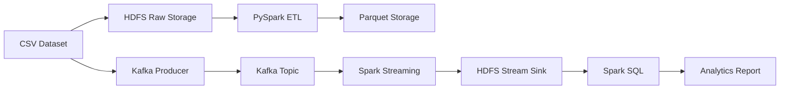

# 🚀 Distributed Big Data Pipeline

> Batch Processing • Streaming Analytics • Machine Learning


End-to-End Distributed Data Engineering Platform using **Hadoop • Spark • Kafka • Machine Learning**

---

## 📌 About

This project implements a complete **Distributed Big Data Pipeline** for processing and analyzing large-scale datasets.

The system combines two processing approaches:

### 🔹 Batch Processing

* Distributed ETL using PySpark SQL
* Data cleaning & transformation
* Parquet optimization
* Machine Learning preparation

### 🔹 Simulated Real-time Streaming

* Python Producer
* Apache Kafka
* Spark Structured Streaming
* HDFS Sink
* Dynamic analytics with Spark SQL

Infrastructure runs on a **3-node Hadoop Cluster** connected through **Tailscale VPN** and managed by **YARN**.

---

## 📖 Table of Contents

* [Architecture](#-architecture)
* [Tech Stack](#-tech-stack)
* [Project Structure](#-project-structure)
* [Features](#-features)
* [Quick Start](#-quick-start)
* [Pipeline Flow](#-pipeline-flow)
* [Future Improvements](#-future-improvements)
* [Authors](#-authors)

---

## 🏗 Architecture



---

## 🛠 Tech Stack

| Layer            | Technology       |
| ---------------- | ---------------- |
| Infrastructure   | 3 Nodes Cluster  |
| Storage          | Hadoop HDFS      |
| Resource Manager | Hadoop YARN      |
| Batch Processing | Apache Spark     |
| Streaming        | Apache Kafka     |
| Analytics        | Jupyter Notebook |
| Machine Learning | Scikit-learn     |

---

## 📂 Project Structure

```text
BIGDATA
│
├── data/
│
├── notebooks/
│
├── src/
│   ├── batch/
│   │   ├── clean_data.py
│   │   └── report_sql.py
│   │
│   ├── streaming/
│   │   ├── kafka_producer.py
│   │   └── spark_consumer.py
│   │
│   ├── ml/
│   │   ├── train_model.py
│   │   └── predict.py
│   │
│   ├── config/
│   │   └── settings.py
│   │
│   └── utils/
│       └── spark_session.py
│
├── requirements.txt
├── README.md
└── .gitignore
```

---

## ✨ Features

### Batch Layer

* Automated ETL Pipeline
* Distributed Processing
* Data Cleaning
* Machine Learning Integration

### Streaming Layer

* Kafka-based Data Streaming
* Spark Structured Streaming
* Dynamic Analytics

### Infrastructure

* Fault Tolerance
* Data Replication
* Resource Scheduling

---

## 🚀 Quick Start

### 1. Start Hadoop Cluster

```bash
start-dfs.cmd
start-yarn.cmd
```

Start Kafka:

```bash
zookeeper-server-start
kafka-server-start
```

---

### 2. Join Worker Nodes

```bash
hdfs datanode
yarn nodemanager
```

---

### 3. Execute Batch Pipeline

```bash
spark-submit src/batch/clean_data.py

spark-submit src/ml/train_model.py
```

---

### 4. Execute Streaming Pipeline

Consumer:

```bash
spark-submit src/streaming/spark_consumer.py
```

Producer:

```bash
python src/streaming/kafka_producer.py
```

---

## 📊 Pipeline Flow

```text
CSV
 ↓
HDFS
 ↓
Spark ETL
 ↓
Parquet
 ↓
Machine Learning


CSV
 ↓
Kafka
 ↓
Spark Streaming
 ↓
HDFS
 ↓
Spark SQL
 ↓
Analytics
```

---

## 🎯 Future Improvements

* Docker Deployment
* Kubernetes Integration
* Airflow Scheduling
* Dashboard Monitoring
* Real-time Visualization

---

## 👨‍💻 Authors

| Member               | Responsibility      |
| -------------------- | ------------------- |
| Lê Doãn Phú          | Data Engineering    |
| Nguyễn Kiều Minh Trí | System Architecture |
| Nguyễn Khánh Hoàng   | Streaming & ML      |

---

⭐ Big Data Project • 2026
