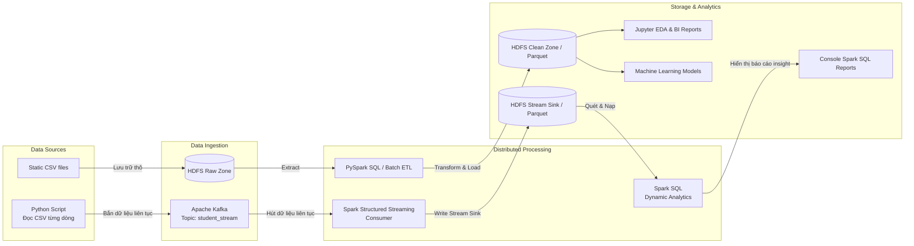

# 🚀 Distributed Big Data Pipeline: Batch & Simulated Real-time Analytics


📌 **Dự án được phát triển trong khuôn khổ Đồ án môn học Big Data** 📅 **Thời gian hoàn thành:** [06/2026]  
👥 **Tác giả (Nhóm 5):** Lê Doãn Phú, Nguyễn Kiều Minh Trí, Nguyễn Khánh Hoàng  

---

## 📌 Giới thiệu dự án (Project Overview)
Dự án này xây dựng một hệ thống **Data Pipeline phân tán hoàn chỉnh từ đầu đến cuối (End-to-End)**, được thiết kế để lưu trữ, tiền xử lý và khai phá khối lượng lớn dữ liệu phân tán trên nền tảng Hadoop và Spark.

Hệ thống tích hợp hai luồng xử lý song song mang tính ứng dụng thực tiễn cao:
1. **Batch Processing (Xử lý theo Lô):** Xử lý khối lượng lớn dữ liệu tĩnh bằng PySpark SQL để làm sạch, chuẩn hóa cấu trúc (ETL Pipeline), lưu trữ tối ưu dưới dạng Parquet và phục vụ huấn luyện các mô hình Machine Learning dự đoán kết quả học tập.
2. **Simulated Real-time Streaming (Xử lý Luồng giả lập):** Kịch bản Python Producer đọc file dữ liệu nguồn và truyền tải (stream) liên tục vào Apache Kafka theo từng giây. **Spark Structured Streaming** đóng vai trò Consumer lắng nghe Kafka, tính toán vi lô (micro-batch) và kết xuất trực tiếp xuống hệ thống tệp lưu trữ **HDFS**. Sau đó, cấu trúc **Spark SQL** được triển khai để quét thư mục luồng này, phân tích và kết xuất báo cáo động (Dynamic Analytics) trực tiếp trên màn hình console.

> 💡 **Hạ tầng phân tán:** Hệ thống vận hành trên một **Cụm máy chủ phân tán (Distributed Cluster) gồm 3 Node vật lý độc lập** kết nối qua mạng riêng ảo (Tailscale VPN) và được điều phối tài nguyên chặt chẽ bởi Hadoop YARN.

---

## 🏗️ Kiến trúc Hệ thống (Architecture Diagram)



## 🛠️ Công nghệ sử dụng (Tech Stack)
* **Hạ tầng (Infrastructure):** Cụm 3 Node (1 Master, 2 Workers) liên kết qua Tailscale VPN.
* **Lưu trữ phân tán (Storage):** Hadoop Distributed File System (HDFS).
* **Điều phối tài nguyên (Resource Manager):** Hadoop YARN.
* **Xử lý Dữ liệu Lô (Batch ETL):** Apache Spark Core, Spark SQL, PySpark.
* **Xử lý Luồng (Real-time Streaming):** Apache Kafka & Spark Structured Streaming.
* **Khám phá Dữ liệu & AI:** Jupyter Notebook, Pandas, Scikit-learn (ML).

## 📂 Cấu trúc thư mục (Directory Structure)
```text
📦BIGDATA
 ┣ 📂data/               # Thư mục chứa sample data test cục bộ
 ┣ 📂notebooks/          # Chứa các file Jupyter (Initial EDA, Insight Reports)
 ┣ 📂src/                # MÃ NGUỒN CHÍNH CỦA HỆ THỐNG
 ┃ ┣ 📂batch/            # Nơi chứa luồng ETL
 ┃ ┃ ┣ 📄clean_data.py   # Làm sạch lô lớn
 ┃ ┃ ┗ 📄report_sql.py   # Viết SQL báo cáo tĩnh
 ┃ ┣ 📂config/           # Nơi chứa cấu hình
 ┃ ┃ ┗ 📄settings.py     # Chứa IP của HDFS và Kafka 
 ┃ ┣ 📂utils/            # Nơi chứa công cụ dùng chung
 ┃ ┃ ┗ 📄spark_session.py# Chứa hàm khởi tạo kết nối Spark
 ┃ ┣ 📂ml/               # Nơi chứa Machine Learning
 ┃ ┃ ┣ 📄train_model.py  # Dạy AI
 ┃ ┃ ┗ 📄predict.py      # Dùng AI dự đoán
 ┃ ┗ 📂streaming/        # Nơi chứa luồng Real-time giả lập
 ┃   ┣ 📄kafka_producer.py  # Đọc CSV ném vào Kafka từng giây
 ┃   ┗ 📄spark_consumer.py  # Spark hút data từ Kafka về xử lý trực tiếp
 ┣ 📜.gitignore          # Quy tắc bỏ qua file data lớn khi push Github
 ┣ 📜requirements.txt    # Danh sách thư viện Python
 ┗ 📜README.md
```

## 🚀 Tính năng nổi bật (Key Features)
1. **Khả năng chịu lỗi cao (Fault Tolerance):** Cấu hình `Replication = 3` trên HDFS đảm bảo dữ liệu an toàn tuyệt đối ngay cả khi 1-2 node trong cụm bị sập.
2. **Xử lý song song (Data Locality):** Áp dụng YARN để phân chia công việc xử lý dữ liệu ngay tại máy chứa dữ liệu, tối ưu hóa tốc độ tính toán phân tán.
3. **Automated ETL Pipeline:** Xây dựng luồng PySpark tự động trích xuất dữ liệu rác, làm sạch (Transform) và lưu trữ thành dạng Parquet.
4. **Real-time Kafka Integration:** Đột phá với kịch bản giả lập Real-time Producer bắn dữ liệu liên tục vào Kafka, kết hợp với Spark Consumer để tính toán và phát hiện thông tin tức thời.

## 💻 Hướng dẫn chạy dự án (How to run)

**1. Khởi động Cụm Hadoop & Kafka (Trên máy Master):**
```bash
start-dfs.cmd
start-yarn.cmd
# Bật Kafka (Zookeeper & Server)
```

**2. Tham gia Cụm (Trên máy Worker):**
```bash
hdfs datanode
yarn nodemanager
```

**3. Chạy luồng Batch (Làm sạch Data & Học máy):**
```bash
spark-submit src/batch/clean_data.py
spark-submit src/ml/train_model.py
```

**4. Chạy luồng Streaming (Giả lập Real-time):**
```bash
# Bật Terminal 1: Khởi động Spark Consumer để chờ hút dữ liệu
spark-submit src/streaming/spark_consumer.py

# Bật Terminal 2: Kích hoạt Máy bắn bóng (Producer) bắn file CSV
python src/streaming/kafka_producer.py
```

---
*Dự án được phát triển trong khuôn khổ Đồ án môn học Big Data - [06/2026].*
*Tác giả: Nhóm 5 - Lê Doãn Phú,
                   Nguyễn Kiều Minh Trí,
                   Nguyễn Khánh Hoàng*
