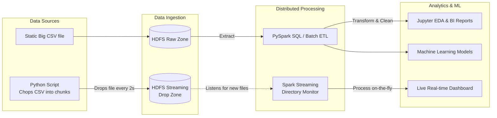

# 🚀 Distributed Big Data Pipeline & Simulated Real-time Analytics


## 📌 Giới thiệu dự án (Project Overview)
Dự án này là một hệ thống **Data Pipeline phân tán** hoàn chỉnh từ đầu đến cuối (End-to-End), được thiết kế để xử lý khối lượng lớn dữ liệu phân tán trên HDFS. 

Điểm độc đáo của dự án là khả năng hỗ trợ đồng thời 2 luồng xử lý:
1. **Batch Processing:** Xử lý dữ liệu lô truyền thống bằng Spark SQL.
2. **Simulated Real-time Streaming:** Giả lập luồng dữ liệu thời gian thực (Real-time) bằng cách sử dụng File Stream kết hợp Spark Streaming để giám sát thư mục HDFS tự động.

Hệ thống được vận hành trên một **Cụm máy chủ phân tán (Distributed Cluster)** gồm 3 máy tính vật lý độc lập kết nối với nhau thông qua mạng riêng ảo (Tailscale VPN), mô phỏng môi trường thực tế tại các doanh nghiệp.

## 🏗️ Kiến trúc Hệ thống (Architecture)



## 🛠️ Công nghệ sử dụng (Tech Stack)
* **Hạ tầng (Infrastructure):** Cụm 3 Node (1 Master, 2 Workers) liên kết qua Tailscale VPN.
* **Lưu trữ phân tán (Storage):** Hadoop Distributed File System (HDFS).
* **Điều phối tài nguyên (Resource Manager):** Hadoop YARN.
* **Xử lý Dữ liệu Lô (Batch Processing):** Apache Spark Core, Spark SQL, PySpark.
* **Giả lập Thời gian thực (Real-time Streaming):** Spark Structured Streaming (File Source).
* **Khám phá Dữ liệu & AI:** Jupyter Notebook, Pandas, Scikit-learn (ML).

## 📂 Cấu trúc thư mục (Directory Structure)
```text
📦bigdata-analytics-pipeline
 ┣ 📂data/               # Thư mục chứa sample data test cục bộ
 ┣ 📂notebooks/          # Chứa các file Jupyter (Initial EDA, Insight Reports)
 ┣ 📂src/                # Mã nguồn chính của hệ thống
 ┃ ┣ 📂batch/            # ETL Scripts: spark-submit jobs làm sạch dữ liệu tĩnh
 ┃ ┣ 📂streaming/        # Code Spark Streaming giám sát HDFS & script cắt file giả lập
 ┃ ┣ 📂ml/               # Machine Learning: Traning models & Predictions
 ┃ ┣ 📂config/           # Cấu hình IP cluster, biến môi trường
 ┃ ┗ 📂utils/            # Helper functions (Spark session builder)
 ┣ 📂scripts/            # Các file .cmd/.sh tự động hóa quá trình chạy jobs
 ┣ 📜.gitignore          # Quy tắc bỏ qua file data lớn khi push Github
 ┣ 📜requirements.txt    # Danh sách thư viện Python
 ┗ 📜README.md
```

## 🚀 Tính năng nổi bật (Key Features)
1. **Khả năng chịu lỗi cao (Fault Tolerance):** Cấu hình `Replication = 3` trên HDFS đảm bảo dữ liệu an toàn tuyệt đối ngay cả khi 1-2 node trong cụm bị sập nguồn.
2. **Xử lý song song (Data Locality):** Áp dụng YARN để phân chia công việc xử lý dữ liệu ngay tại máy chứa dữ liệu, loại bỏ độ trễ truyền tải mạng.
3. **Simulated Real-time Streaming:** Xây dựng kịch bản chia nhỏ file CSV tự động (giả lập dòng dữ liệu) và dùng Spark Streaming để nhận diện file mới ngay khi chúng vừa rơi xuống HDFS, thay thế cho Kafka.
4. **Machine Learning Integration:** Huấn luyện trực tiếp các mô hình Học máy dựa trên nguồn dữ liệu sạch từ luồng Batch.

## 💻 Hướng dẫn chạy dự án (How to run)

**1. Khởi động Cụm Hadoop (Trên máy Master):**
```bash
start-dfs.cmd
start-yarn.cmd
```

**2. Tham gia Cụm (Trên máy Worker):**
```bash
hdfs datanode
yarn nodemanager
```

**3. Chạy luồng Streaming Giả lập:**
```bash
# Bật code Spark Streaming giám sát thư mục
spark-submit src/streaming/stream_processor.py

# Mở 1 cửa sổ CMD khác, bật script thả file liên tục
python src/streaming/simulate_data_drop.py
```

**4. Chạy mô hình Học máy (ML):**
```bash
spark-submit src/ml/train_model.py
```

---
*Dự án được phát triển trong khuôn khổ Đồ án môn học Big Data - [06/2026].*
*Tác giả: Nhóm 5 - Lê Doãn Phú
                   Nguyễn Kiều Minh Trí
                   Nguyễn Khánh Hoàng*
