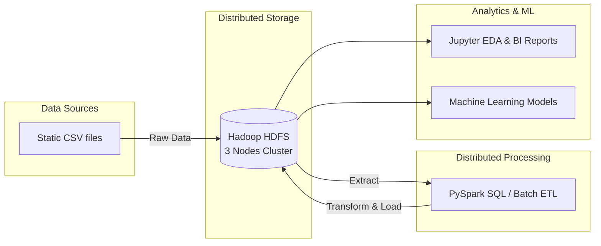

# 🚀 Distributed Big Data Pipeline & Machine Learning Analytics


## 📌 Giới thiệu dự án (Project Overview)
Dự án này là một hệ thống **Data Pipeline phân tán** hoàn chỉnh từ đầu đến cuối (End-to-End), được thiết kế để lưu trữ, xử lý, làm sạch và phân tích khối lượng lớn dữ liệu theo lô (Batch Processing) kết hợp triển khai các mô hình Học máy (Machine Learning).

Điểm nổi bật của dự án là việc thiết lập thành công một **Cụm máy chủ phân tán (Distributed Cluster)** gồm 3 máy tính vật lý độc lập kết nối với nhau thông qua mạng riêng ảo (Tailscale VPN), mô phỏng hoàn hảo môi trường làm việc thực tế tại các doanh nghiệp.

## 🏗️ Kiến trúc Hệ thống (Architecture)



## 🛠️ Công nghệ sử dụng (Tech Stack)
* **Hạ tầng (Infrastructure):** Cụm 3 Node (1 Master, 2 Workers) liên kết qua Tailscale VPN.
* **Lưu trữ phân tán (Storage):** Hadoop Distributed File System (HDFS).
* **Điều phối tài nguyên (Resource Manager):** Hadoop YARN.
* **Xử lý Dữ liệu Lô (Batch Processing / ETL):** Apache Spark Core, Spark SQL, PySpark.
* **Khám phá Dữ liệu & AI:** Jupyter Notebook, Pandas, Scikit-learn (Machine Learning).

## 📂 Cấu trúc thư mục (Directory Structure)
```text
📦bigdata-analytics-pipeline
 ┣ 📂data/               # Thư mục chứa sample data test cục bộ
 ┣ 📂notebooks/          # Chứa các file Jupyter (Initial EDA, Insight Reports)
 ┣ 📂src/                # Mã nguồn chính của hệ thống
 ┃ ┣ 📂batch/            # ETL Scripts: spark-submit jobs làm sạch dữ liệu
 ┃ ┣ 📂ml/               # Machine Learning: Traning models & Predictions
 ┃ ┣ 📂config/           # Cấu hình IP cluster, biến môi trường
 ┃ ┗ 📂utils/            # Helper functions (Spark session builder)
 ┣ 📂scripts/            # Các file .cmd/.sh tự động hóa quá trình chạy jobs
 ┣ 📜.gitignore          # Quy tắc bỏ qua file data lớn khi push Github
 ┣ 📜requirements.txt    # Danh sách thư viện Python
 ┗ 📜README.md
```

## 🚀 Tính năng nổi bật (Key Features)
1. **Khả năng chịu lỗi cao (Fault Tolerance):** Cấu hình `Replication = 3` trên HDFS đảm bảo dữ liệu an toàn tuyệt đối ngay cả khi 1-2 node trong cụm bị sập nguồn.
2. **Xử lý song song (Data Locality):** Áp dụng YARN để phân chia công việc xử lý dữ liệu ngay tại máy chứa dữ liệu, loại bỏ độ trễ truyền tải mạng.
3. **Automated ETL Pipeline:** Kịch bản Python tự động trích xuất dữ liệu rác (Raw Zone), làm sạch (Transform) và lưu trữ dưới định dạng nén Parquet (Clean Zone).
4. **Machine Learning Integration:** Huấn luyện trực tiếp các mô hình Học máy dựa trên nguồn dữ liệu sạch khổng lồ từ cụm HDFS.

## 💻 Hướng dẫn chạy dự án (How to run)

**1. Khởi động Cụm Hadoop (Trên máy Master):**
```bash
start-dfs.cmd
start-yarn.cmd
```

**2. Tham gia Cụm (Trên máy Worker):**
```bash
hdfs datanode
yarn nodemanager
```

**3. Chạy Pipeline Làm sạch Dữ liệu (ETL):**
```bash
spark-submit src/batch/clean_data.py
```

**4. Chạy mô hình Học máy (ML):**
```bash
spark-submit src/ml/train_model.py
```

**5. Xem báo cáo EDA:**
Mở thư mục `notebooks/` và khởi chạy `jupyter notebook` để xem các báo cáo phân tích trực quan.

---
*Dự án được phát triển trong khuôn khổ Đồ án môn học Big Data - [Năm].*
*Tác giả: [Tên của bạn và Nhóm]*
